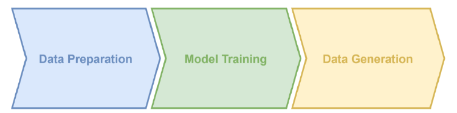
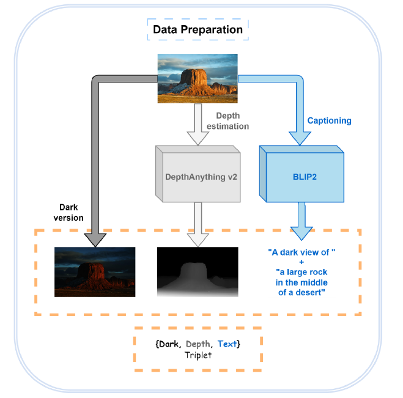
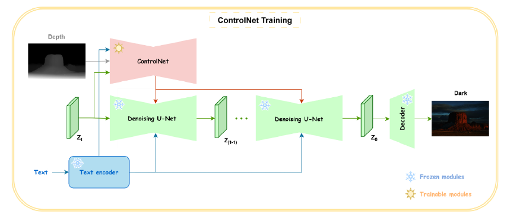
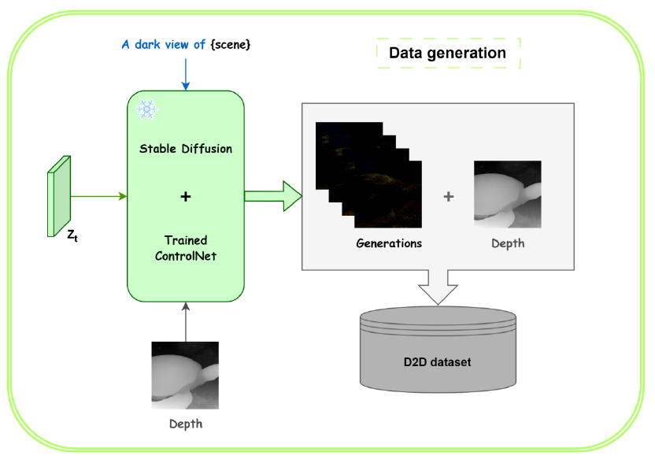

# Depth2Dark: Depth Analysis Enhancement in Dark Conditions

This repository contains my research thesis ["AI and Computer Vision: Depth Analysis Enhancement in Dark Conditions"](https://github.com/Manuelcol89/Depth2Dark/releases/tag/v1.0) implementation.

Starting from diffusion models such as Stable Diffusion and ControlNet, a specific synthetic database of dark images and their depth maps is created in order to refine the training of state-of-the-art depth estimation models to optimise results and minimise errors under challenging conditions.

The project shows a pipeline to create your own artificial dark/depth dataset with Stable Diffusion and ControlNet models.

## Update
- **23.04.2026:** Code Release
- **23.04.2026:** Thesis Release.
- **22.04.2026:** Repo created.

## Requirements
- Python 3.10.8
- PyTorch 1.13.0
- cudatoolkit 11.7

## Usage
<ins>For detailed instructions and informations about the project, please refere to the complete version of the thesis</ins> [HERE](https://github.com/Manuelcol89/Depth2Dark/releases/tag/v1.0).

Here is a brief summary:

* Preprocess your initial dataset

* Train the ControlNet model
  
* Generate the final dataset using Stable Diffusion and ControlNet previously fine-tuned

<p align="center">
  
</p>

### Step 1. Data preparation
<p align="center">
  
</p>

You can download the SICE dataset I already selected [here](https://www.kaggle.com/datasets/manuelcoluccio/sice-dark-cleaned-augmentated). Otherwise you can download the original [SICE](https://li-chongyi.github.io/proj_benchmark.html) dataset, or other paired dark/bright image datasets, and make your onw data selection. The scripts I used for data cleaning and augmentation are [here](Assets/Scripts/Data%20preprocessing).

* Clone Depth-Anything-V2 repo and lunch inference on the bright images, saving depth maps in a 'Depth' folder.

* Install the [LAVIS](https://github.com/salesforce/LAVIS) library for image captioning. The pretrained model will be downloaded and a `metadata.jsonl` file will be saved when all images are processed. You can also select a lighter captioning model depending on the power of your GPU.

The metadata.json file is structured as follows:
```
{"text": "text/caption", "dark_image": "xxxx.png", "depth_image": "xxxx.png"}
```
 
* Prepare a 'triplets' folder containing `{Dark, Depth, Text}` triplets and the script [triplets.py](Assets/Scripts/triplets.py), where 'Dark' and 'Depth' are subfolders and 'text' is the metadata.json file. On triplets.py point `METADATA_PATH`, `IMAGES_DIR`, `CONDITIONING_IMAGES_DIR` to corresponding directories, then launching it will automatically format the dataset at the first loading during training.

### Step 2. Train `Depth2Dark` ControlNet
<p align="center">
  
</p>

`Diffusers` provides self-contained examples for training and deploying ControlNet and more details can be found [here](https://github.com/huggingface/diffusers/tree/main/examples/controlnet).

Now is it possible to start training the ControlNet with the prepared `{Dark, Depth, Text}` triplets. For image generation at extreme darkness conditions, it is necessary to force the Stable Diffusion schedule to a zero terminal SNR (see [this paper](https://arxiv.org/abs/2305.08891) for more details).
For example, to train ControlNet with the fine-tuned `stable-diffusion-v2-1` model zero terminal SNR, run the following command with at least 20 GB of VRAM:
```
accelerate launch train_controlnet.py \
--pretrained_model_name_or_path=" ByteDance/sd2.1-base-zsnr-laionaes6" \
--output_dir="/path/to/output/folder" \
--train_data_dir="/path/to/triplets/folder" \
--resolution=512 \
--mixed_precision="fp16" \
--learning_rate=1e-5 \
--validation_image "/path/to/validation/image/1" "/path/to/validation/image/2"… \
--validation_prompt "caption of image 1" "caption of image 2"… \
--train_batch_size=8 \
--gradient_accumulation_steps=2 \
--max_train_steps=25000
```

Try adjust batch size to improve the training performance depending on the available computational resources. Generally, the more batch, the more efficience of the training.

### Step 3. Generate Depth2Dark dataset
<p align="center">
  
</p>

Now we can generate non-existent dark scenes using another dataset depth and prompts.

1. Prepare a dataset containing bright images and acquire depth maps using DepthAnythingV2 and prompts using Lavis. You can download the [Unsplash2K](https://github.com/dongheehand/unsplash2K) dataset as I did.

2. In 'inference.py' script, set directories and generate dark scenes using the SD2.1 zsnr and `Depth2Dark` ControlNet:
```
cd ../../
python inference.py --base_model_path ByteDance/sd2.1-base-zsnr-laionaes6 --controlnet_path /path/to/depth2dark/controlnet --depth_dir /path/to/bright/depth --output_dir /path/to/output/folder
```
3. Finally, you have your `Depth2Dark` dataset and you can train depth models with it.

### Results
Here some qualitative samples of the final dataset.
<p align="center">
  
</p>
<p align="center">
  
</p>

### Conclusions and future works
This method can be refined and used to create new datasets, not only for tasks related to low-light environments, but also for other specific purposes. In addition, other types of control maps, such as canny edge maps, normal maps, semantic segmentation maps, could also be used as a tool to manage the generation of new data, depending on the objective to be achieved. One can also think of performing image enhancement by conditioning the validation process to generate images with the desired characteristics by tracking latent variables, and using this generative diffusion pipeline as a basis.
Further tests can be done to see if improving the quality of the prompts or adding negative prompts can further improve the quality of the results. In addition, future works could then test if some state-of-the-art models for depth estimation, once fine-tuned with this dataset, will actually be able to generate qualitatively better depth maps.

### Acknowledgements
Thanks to the teams behind [DepthAnythingV2](https://github.com/DepthAnything/Depth-Anything-V2), [Stable Diffusion](https://github.com/CompVis/stable-diffusion), [ControlNet](https://github.com/lllyasviel/ControlNet), [Atlantis](https://github.com/zkawfanx/Atlantis), [ByteDance](https://huggingface.co/ByteDance/sd2.1-base-zsnr-laionaes6), [LAVIS](https://github.com/salesforce/LAVIS) and [Diffusers](https://github.com/huggingface/diffusers) for their exeptional work.
