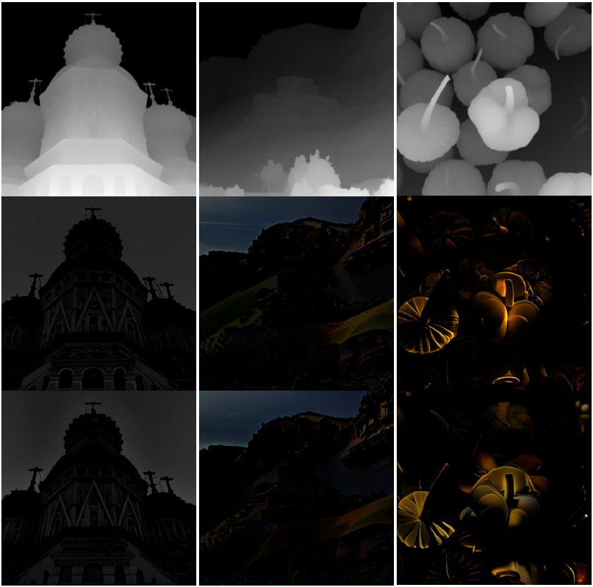
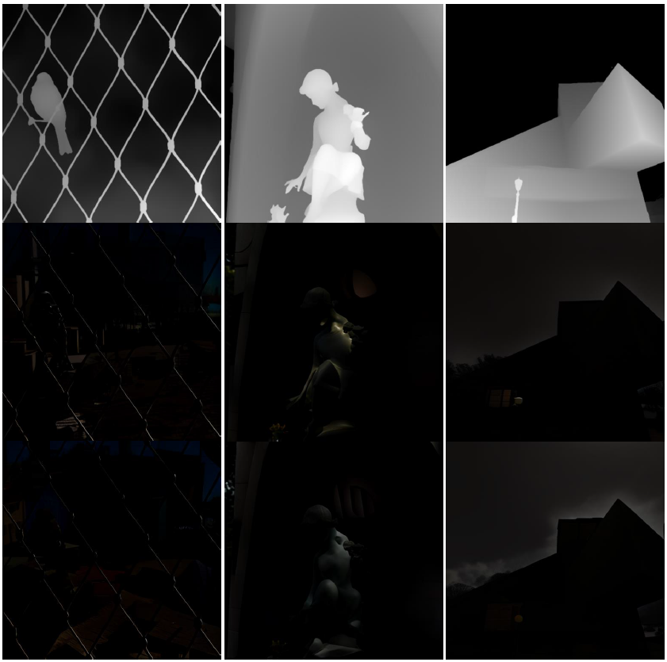

# Depth2Dark: Depth Analysis Enhancement in Dark Conditions

This repository contains my research thesis "AI and Computer Vision: Depth Analysis Enhancement in Dark Conditions" implementation.

Starting from diffusion models such as Stable Diffusion and ControlNet, a specific synthetic database of dark images and their depth maps is created in order to refine the training of state-of-the-art depth estimation models to optimise results and minimise errors under challenging conditions.

For more detailed instructions and informations about the project, please refere to the complete version of the thesis [HERE](https://github.com/Manuelcol89/Depth2Dark/releases/tag/v1.0).

## Update
- **23.04.2026:** Code Release
- **23.04.2026:** Thesis Release.
- **22.04.2026:** Repo created.

## Requirements
- Python 3.10.8
- PyTorch 1.13.0
- cudatoolkit 11.7

## Usage

### Step 1. Prepare `{Dark, Depth, Text}` triplets
To train the `Depth2Dark` ControlNet using `diffusers`, first organize the data triplets into the following structure:
```
<triplets>
    |--Dark
    |   |--0000.png
    |   |--0001.png
    |   |--...
    |
    |--Depth
    |   |--0000.png
    |   |--0001.png
    |   |--...
    |
    |--metadata.jsonl
    |--<triplets>.py
```
The `metadata.jsonl` file contains the text description, the filenames to each dark image and depth as follows:
```
{"text": "some/text/descriptions", "image": "xxxx.png", "conditioning_image": "xxxx.png"}
```
and `<triplets>.py` is the script for loading the data named by `<triplets>` folder.

#### Dark
Place your dark images in the `dark` folder, you can download the SICE dataset already selected by us [here](https://www.kaggle.com/datasets/manuelcoluccio/sice-dark-cleaned-augmentated). Otherwise you can download the original [SICE](https://li-chongyi.github.io/proj_benchmark.html) dataset, or other paired dark/bright image datasets, and make your onw data selection.

#### Depth
Clone the [DepthAnythingV2](https://github.com/DepthAnything/Depth-Anything-V2) repo:
```
git clone https://github.com/DepthAnything/Depth-Anything-V2.git
```
Install necessary dependencies by:
```
cd Depth-Anything-V2
pip install requirements.txt
```
Then you can predict depth with it by simply running:
```
python run.py --encoder vitl --img-path /path/to/bright/folder --outdir /path/to/depth/folder --pred-only --grayscale

```

#### Text
Install the [LAVIS](https://github.com/salesforce/LAVIS) library for image captioning:
```
pip install salesforce-lavis
```
Then you can generate text descriptions by running:
```
cd ../
python source/caption.py --input /path/to/bright/folder --output /path/to/triplets/folder
```
the pretrained model will be downloaded and `metadata.jsonl` will be saved when all images are processed.
You can also select a lighter captioning model depending on the power of your GPU.

Finally, modify the `triplets.py` script and point `METADATA_PATH`, `IMAGES_DIR`, `CONDITIONING_IMAGES_DIR` to corresponding directories. Place the script inside `<triplets>` folder and the dataset will be automatically formatted at the first loading during training.

### Step 2. Train `Depth2Dark` ControlNet
`Diffusers` provides self-contained examples for training and deploying ControlNet and more details can be found [here](https://github.com/huggingface/diffusers/tree/main/examples/controlnet).

The training script requires the up-to-date install of `diffusers`, thus install it from source as instructed:
```
git clone https://github.com/huggingface/diffusers
cd diffusers
pip install -e .
```
Then install the requirements for the ControlNet example:
```
cd examples/controlnet
pip install -r requirements.txt
```

Now is it possible to start training the ControlNet with the prepared `{Dark, Depth, Text}` triplets. For image generation at extreme darkness conditions, it is necessary to force the Stable Diffusion schedule to a zero terminal SNR (see [this paper](https://arxiv.org/abs/2305.08891) for more details).
For example, to train ControlNet with the fine-tuned `stable-diffusion-v2-1` model zero terminal SNR, run the following command with at least 20 GB of VRAM:
```
accelerate launch train_controlnet.py \
--pretrained_model_name_or_path=" ByteDance/sd2.1-base-zsnr-laionaes6" \
--output_dir="/path/to/output/folder" \
--train_data_dir="/path/to/triplets/folder" \
--resolution=512 \
--mixed_precision="fp16" \
--learning_rate=1e-5 \
--validation_image "/path/to/validation/image/1" "/path/to/validation/image/2"… \
--validation_prompt "caption of image 1" "caption of image 2"… \
--train_batch_size=8 \
--gradient_accumulation_steps=2 \
--max_train_steps=25000
```
Prepare unseen depths and tailored prompts for validation, so it can tell if the model is trained correctly until the [sudden converge phenomenon](https://github.com/lllyasviel/ControlNet/blob/main/docs/train.md#more-consideration-sudden-converge-phenomenon-and-gradient-accumulation) is reached (this tutorial and [discussion](https://github.com/lllyasviel/ControlNet/discussions/318#discussioncomment-7176692) are both beneficial). Keep training for more steps after that to ensure the model is well-trained.

If you have enough computing resources, try as large batch sizes as possible to get better results.

### Step 3. Generate `D2D` of your own
It is now possible to generate non-existent dark scenes using another dataset depth and prompts.

1. Prepare a dataset containing bright images and acquire depth maps using DepthAnythingV2 as above. You can download the [SICE](https://li-chongyi.github.io/proj_benchmark.html) dataset as I did.

2. Modify directories and generate dark scenes using the SD2.1 zsnr and `Depth2Dark` ControlNet:
```
cd ../../
python inference.py --base_model_path ByteDance/sd2.1-base-zsnr-laionaes6 --controlnet_path /path/to/depth2dark/controlnet --depth_dir /path/to/bright/depth --output_dir /path/to/output/folder
```
3. Finally, generate a `D2D` of your own and could train depth models with it.



